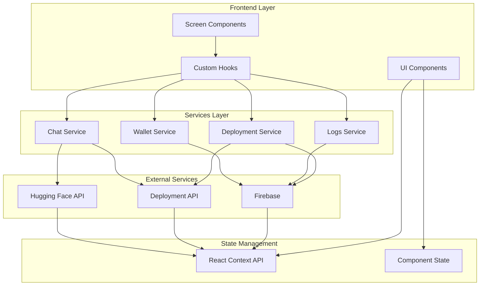
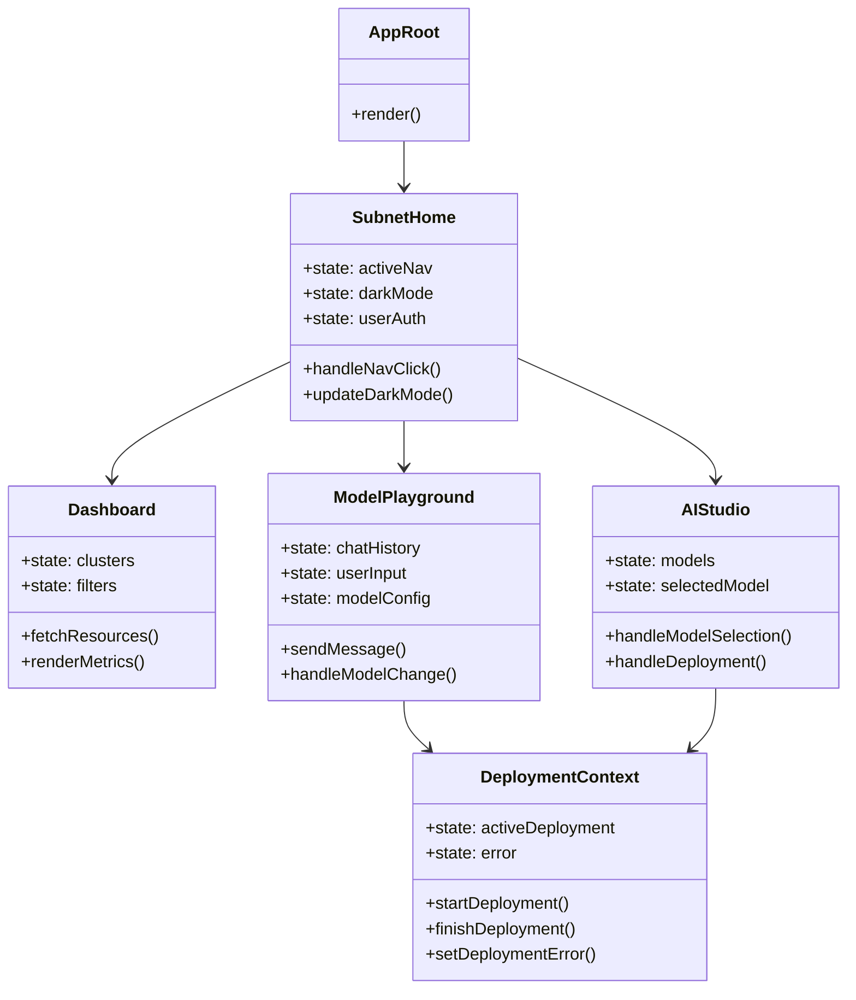
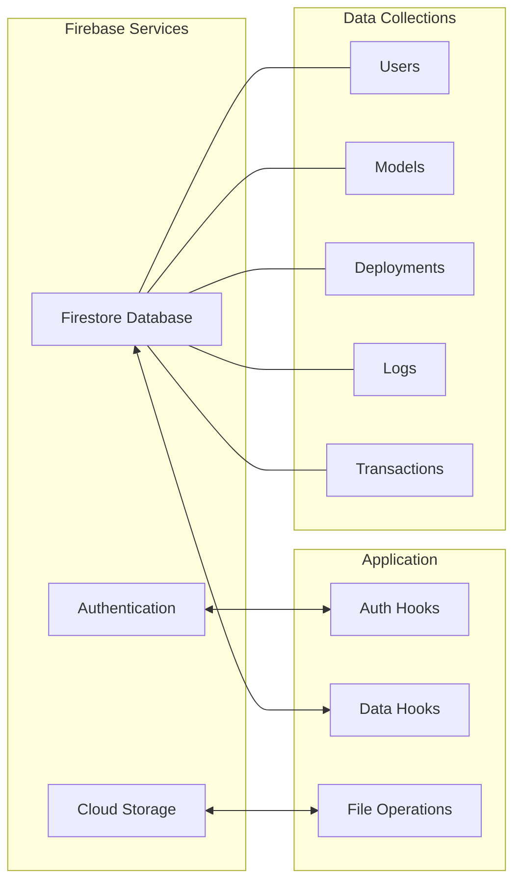
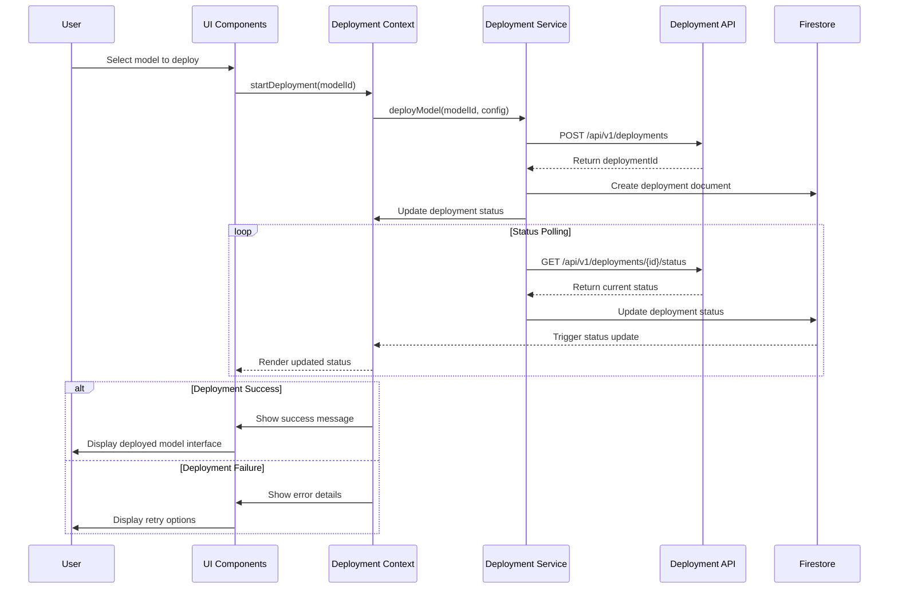
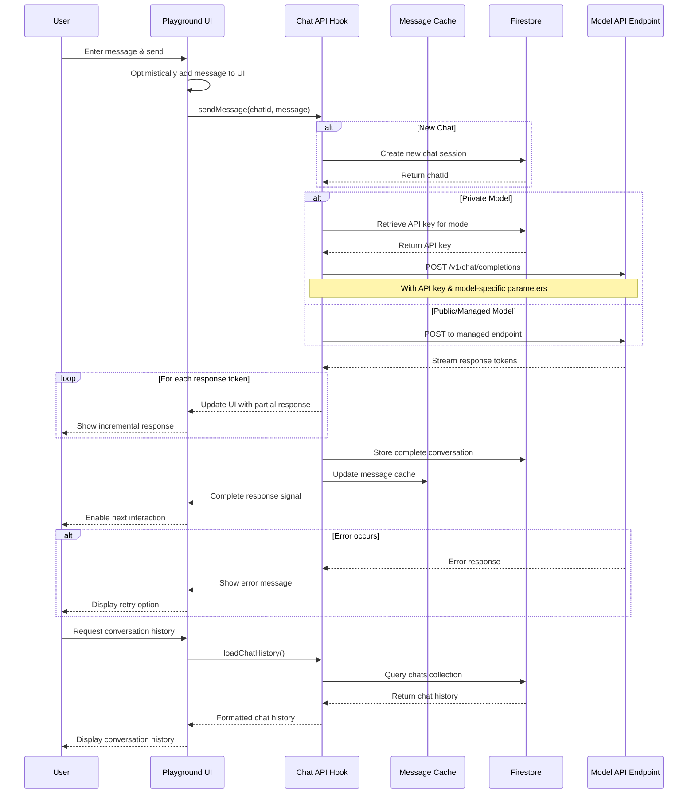
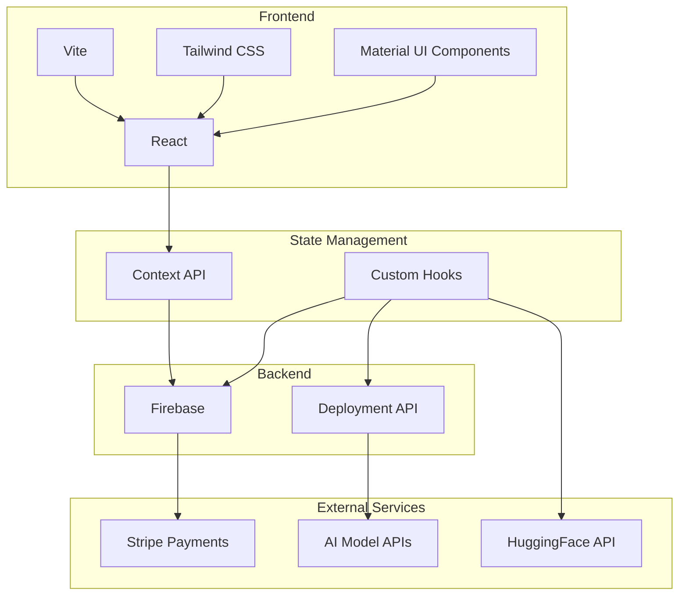
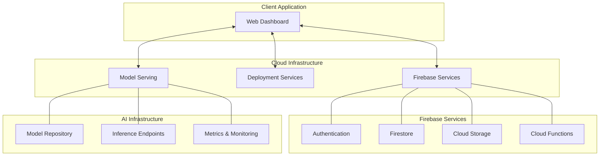

# Polaris Dashboard Architecture

This document outlines the architecture of the Polaris Dashboard project, providing visual representations of its component structure, data flow, and system interactions.

## Core Architecture Overview



## Component Structure



## Data Flow Architecture

```
┌────────────────────────┐     ┌───────────────────────┐     ┌────────────────────────┐
│                        │     │                       │     │                        │
│      User Interface    │◄────┤    State Management   │◄────┤     External APIs      │
│                        │     │                       │     │                        │
└───────────┬────────────┘     └─────────┬─────────────┘     └──────────┬─────────────┘
            │                            │                              │
            ▼                            ▼                              ▼
┌────────────────────────┐     ┌───────────────────────┐     ┌────────────────────────┐
│                        │     │                       │     │                        │
│   User Interactions    │────►│    Service Layer      │────►│     Firebase/Cloud     │
│                        │     │                       │     │                        │
└────────────────────────┘     └───────────────────────┘     └────────────────────────┘
```

## Firebase Integration



## Model Deployment Flow



## Model Chat Interaction Flow



## Model Playground Architecture

```
┌───────────────────────────────────────────────────────────────────────────┐
│                        Model Playground Component                          │
├───────────────┬───────────────────────────────────┬─────────────────────┬─┘
│ Left Sidebar  │        Main Chat Area             │   Right Sidebar     │
│               │                                   │                     │
│ ┌───────────┐ │ ┌───────────────────────────────┐ │ ┌─────────────────┐ │
│ │ Chat      │ │ │                               │ │ │  Model Select   │ │
│ │ Projects  │ │ │                               │ │ │                 │ │
│ │           │ │ │       Message History         │ │ │ ┌─────────────┐ │ │
│ ├───────────┤ │ │                               │ │ │ │ Temperature │ │ │
│ │ History   │ │ │                               │ │ │ ├─────────────┤ │ │
│ │ List      │ │ │                               │ │ │ │ Max Tokens  │ │ │
│ │           │ │ │                               │ │ │ ├─────────────┤ │ │
│ ├───────────┤ │ ├───────────────────────────────┤ │ │ │ System      │ │ │
│ │           │ │ │ ┌───────────────────────────┐ │ │ │ │ Prompt      │ │ │
│ │  Project  │ │ │ │    Message Input          │ │ │ │ │             │ │ │
│ │  Actions  │ │ │ └───────────────────────────┘ │ │ └─────────────┘ │ │
│ │           │ │ │                               │ │                 │ │
└───────────────┴───────────────────────────────────┴─────────────────────┘
```

## System Component Hexagonal Architecture

```
                ┌───────────────┐                                      
                │               │                                      
                │  UI Layer     │                                      
                │               │                                      
                └───────┬───────┘                                      
                        │                                              
                        ▼                                              
┌───────────────┐   ┌───────────────┐   ┌───────────────┐              
│               │   │               │   │               │              
│  AIStudio     │◄──┤  Core Logic   ├──►│  Dashboard    │              
│  Components   │   │  & State      │   │  Components   │              
│               │   │               │   │               │              
└───────┬───────┘   └───────┬───────┘   └───────┬───────┘              
        │                   │                   │                      
        │                   ▼                   │                      
        │           ┌───────────────┐           │                      
        │           │               │           │                      
        └───────────┤   Services    ├───────────┘                      
                    │   Layer       │                                  
                    │               │                                  
                    └───────┬───────┘                                  
                            │                                          
                            ▼                                          
                    ┌───────────────┐                                  
                    │               │                                  
                    │  External     │                                  
                    │  Resources    │                                  
                    │               │                                  
                    └───────────────┘                                  
```

## Technology Stack



## Key Feature Relationships

```
┌─────────────────────────────────────────────────────────────────────────┐
│                                                                         │
│  ┌─────────────┐         ┌────────────────┐         ┌─────────────────┐ │
│  │             │         │                │         │                 │ │
│  │ AI Model    │─────────┤ Model          ├─────────┤ AI Studio      │ │
│  │ Management  │         │ Playground     │         │ Interface      │ │
│  │             │         │                │         │                 │ │
│  └─────────────┘         └────────────────┘         └─────────────────┘ │
│         │                       │                          │            │
│         │                       │                          │            │
│         ▼                       ▼                          ▼            │
│  ┌─────────────┐         ┌────────────────┐         ┌─────────────────┐ │
│  │             │         │                │         │                 │ │
│  │ Deployment  │─────────┤ Monitoring     ├─────────┤ Analytics      │ │
│  │ Service     │         │ & Logs         │         │ Dashboard      │ │
│  │             │         │                │         │                 │ │
│  └─────────────┘         └────────────────┘         └─────────────────┘ │
│         │                       │                          │            │
│         │                       │                          │            │
│         ▼                       ▼                          ▼            │
│  ┌─────────────┐         ┌────────────────┐         ┌─────────────────┐ │
│  │             │         │                │         │                 │ │
│  │ User        │─────────┤ Billing &      ├─────────┤ Community      │ │
│  │ Management  │         │ Payments       │         │ Features       │ │
│  │             │         │                │         │                 │ │
│  └─────────────┘         └────────────────┘         └─────────────────┘ │
│                                                                         │
└─────────────────────────────────────────────────────────────────────────┘
```

## Deployment Infrastructure



This architecture documentation provides a comprehensive overview of the Polaris Dashboard system, illustrating its component relationships, data flow, and integration with external services...