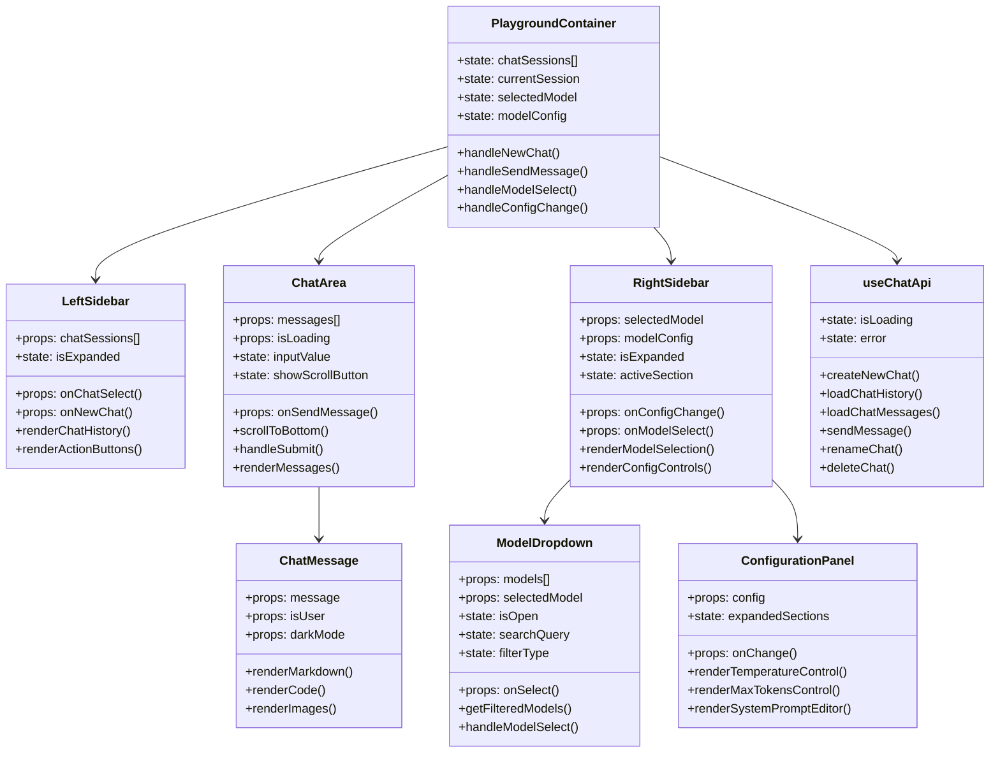
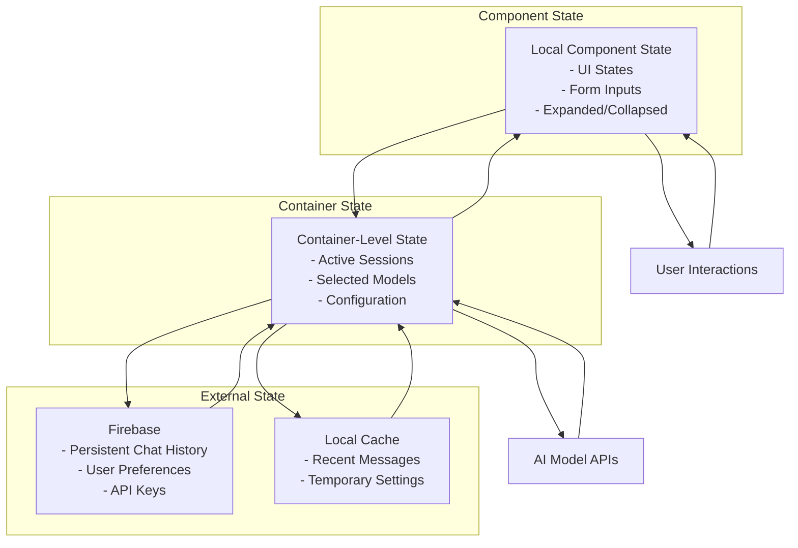
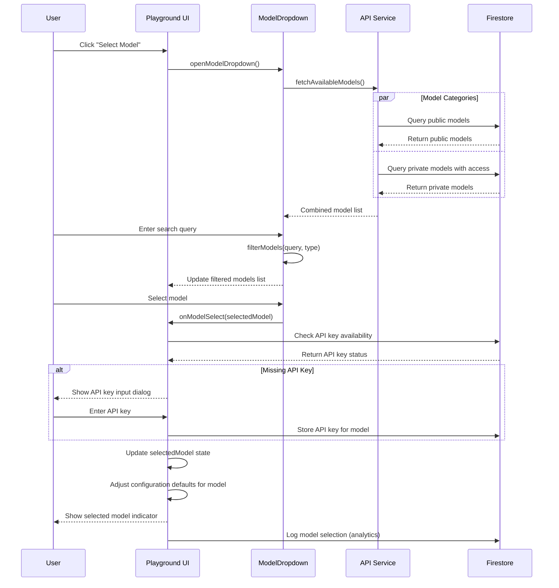
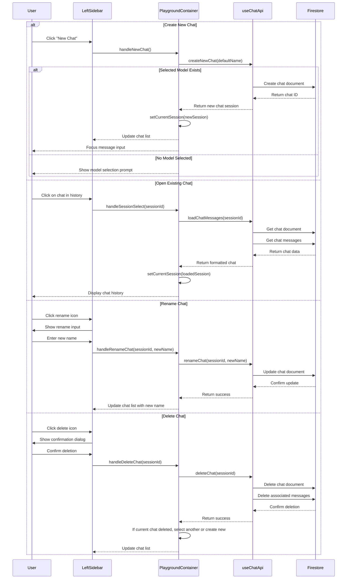
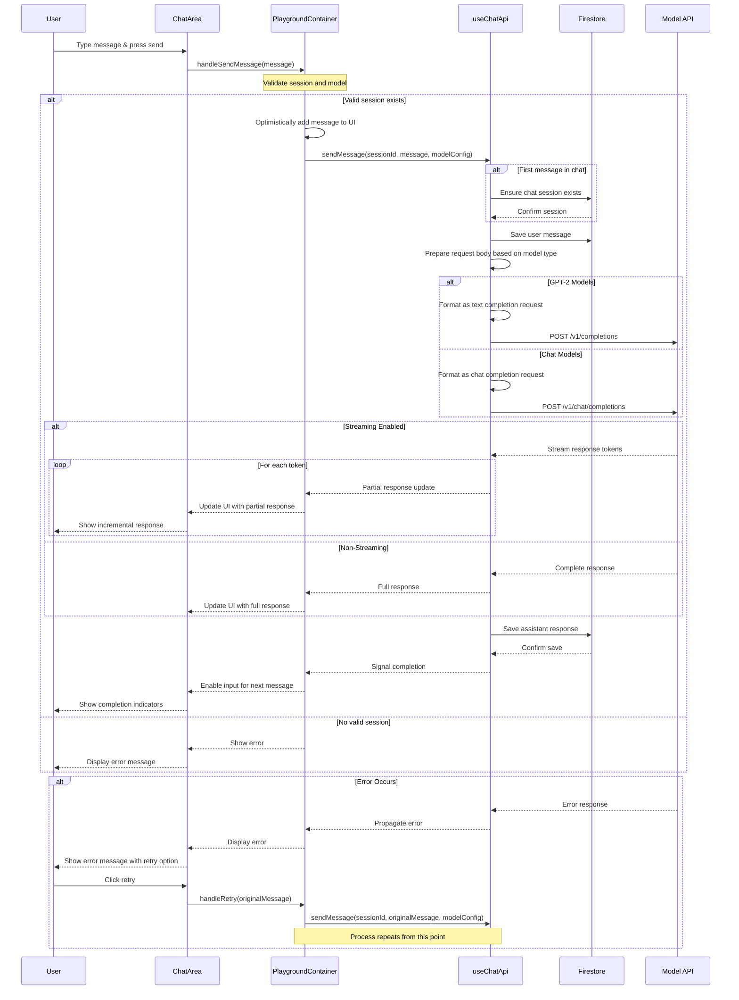
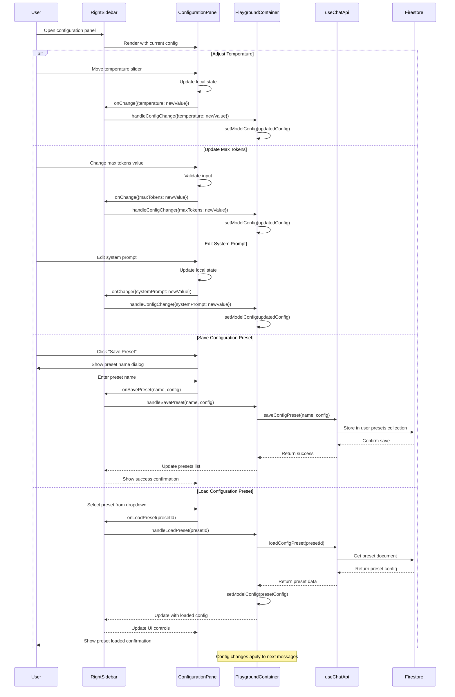
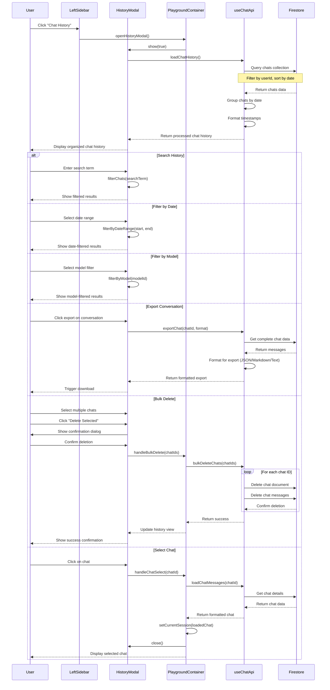
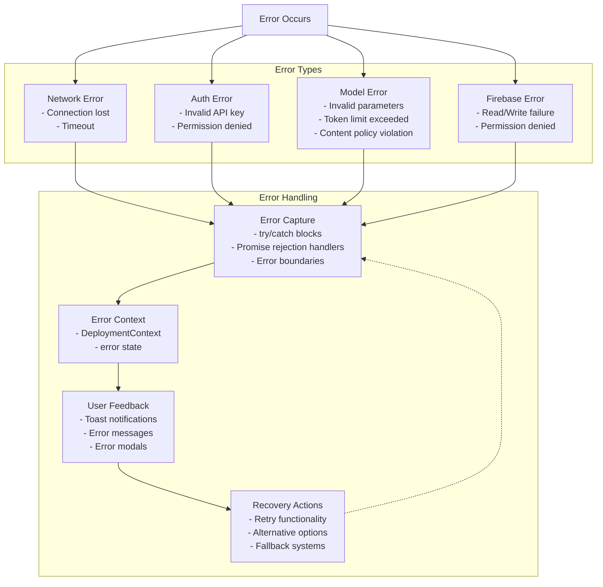

# Polaris Dashboard - Model Playground Architecture

This document provides a detailed architecture overview of the Model Playground component within the Polaris Dashboard system. The playground enables interactive communication with AI models, session management, model configuration, and deployment monitoring.

## Table of Contents

1. [Component Architecture](#component-architecture)
2. [Data Flow Patterns](#data-flow-patterns)
3. [Key Interaction Sequences](#key-interaction-sequences)
   - [Model Selection Flow](#model-selection-flow)
   - [Chat Session Management](#chat-session-management)
   - [Message Exchange Flow](#message-exchange-flow)
   - [Configuration Management](#configuration-management)
   - [History & Session Management](#history--session-management)
4. [Error Handling Patterns](#error-handling-patterns)
5. [Performance Considerations](#performance-considerations)

## Component Architecture

### Component Responsibilities

1. **PlaygroundContainer**: 
   - Root component managing overall state and orchestrating interactions
   - Maintains current chat session, model selection, and configuration

2. **LeftSidebar**:
   - Displays chat history and sessions
   - Provides navigation and chat session management

3. **ChatArea**:
   - Renders message history
   - Handles message input
   - Manages scrolling behavior

4. **ChatMessage**:
   - Renders individual messages with formatting
   - Supports markdown, code highlighting, and media

5. **RightSidebar**:
   - Houses model selection and configuration
   - May contain multiple panels/sections

6. **ModelDropdown**:
   - Handles model browsing and selection
   - Implements search and filtering

7. **ConfigurationPanel**:
   - Provides controls for model parameters
   - Manages system prompts and model settings

8. **useChatApi**:
   - Custom hook for interfacing with chat services
   - Handles data persistence and retrieval

## Data Flow Patterns

## Key Interaction Sequences

### Model Selection Flow

### Chat Session Management

### Message Exchange Flow

### Configuration Management

### History & Session Management

## Error Handling Patterns

## Performance Considerations

```mermaid
graph TD
    subgraph "Performance Optimizations"
        Virtualization["List Virtualization\n- Virtual chat history\n- Only render visible messages"]
        Memoization["Component Memoization\n- React.memo for pure components\n- useMemo for expensive calculations"]
        Lazy["Lazy Loading\n- Code splitting\n- Dynamic imports"]
        Throttling["Request Throttling\n- Debounce input handlers\n- Throttle API calls"]
    end
    
    subgraph "State Management"
        LocalState["Local State Optimization\n- Prefer local state when possible\n- Minimize prop drilling"]
        MsgCache["Message Caching\n- Cache recent messages\n- Minimize Firebase reads"]
        Pagination["Response Pagination\n- Paginate long histories\n- Infinite scrolling"]
    end
    
    subgraph "Resource Management"
        Cleanup["Proper Cleanup\n- Clear listeners in useEffect\n- Cancel API requests\n- Clear intervals/timeouts"]
        MemLeak["Memory Leak Prevention\n- Avoid closures over changing values\n- Watch for unintentional references"]
        EventCleanup["Event Listener Management\n- Remove unneeded listeners\n- Use passive listeners"]
    end
    
    Virtualization --> Performance
    Memoization --> Performance
    Lazy --> Performance
    Throttling --> Performance
    
    LocalState --> Performance
    MsgCache --> Performance
    Pagination --> Performance
    
    Cleanup --> Performance
    MemLeak --> Performance
    EventCleanup --> Performance
    
    Performance[Performance Outcome]
    
    Performance --> UserXP[Improved User Experience]
```

This document provides a comprehensive view of the Model Playground architecture, detailing component relationships, data flows, and interaction patterns. Each sequence diagram illustrates a specific user journey within the playground, highlighting the complex orchestration of frontend components, state management, external services, and persistent storage. 